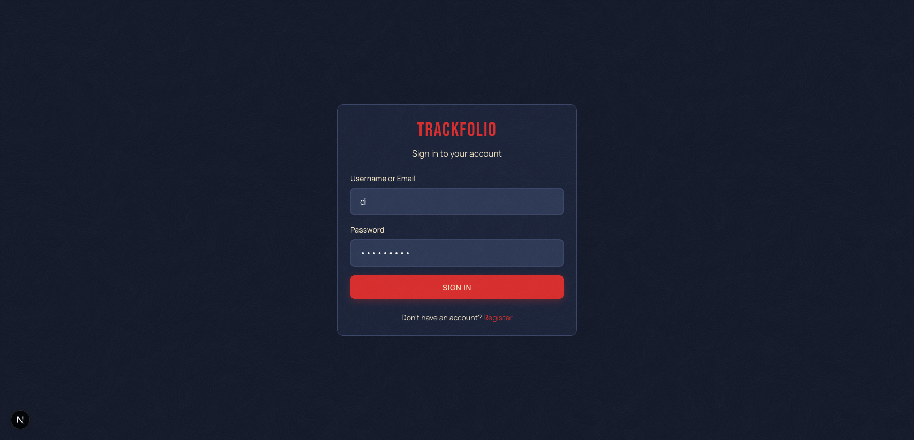

<p align="center">
  
</p>

<h1 align="center">Trackfolio</h1>

<p align="center">
  Investment portfolio tracking and sandbox trading analysis platform.
  <br />
  <a href="https://trackfolio.vercel.app"><strong>Live Demo &rarr;</strong></a>
</p>

<p align="center">
  
  
  
  
</p>

---

## Overview

Trackfolio is a full-stack portfolio management tool that connects to brokerage APIs to provide real-time portfolio analysis, risk allocation tracking, rebalancing recommendations, and sandbox trading capabilities. This repository contains the **frontend** application.

### Key Features

- **Portfolio Dashboard** — Real-time portfolio metrics, P&L analysis, invested amounts, and allocation breakdowns
- **Position Management** — Sortable, filterable positions table with profit/loss indicators, exit drawdown progress, and inline target editing
- **Risk Allocation** — Visual risk structure breakdown comparing current vs. target allocations with disbalance indicators
- **Rebalancing Recommendations** — Actionable buy/sell recommendations based on portfolio structure analysis
- **Currency Breakdown** — Multi-currency holdings overview with percentage distribution
- **Instrument Search & Trading** — Search instruments and place sandbox market orders
- **Settings Management** — Configure broker API clients, select accounts, set risk profiles, and manage position targets
- **Authentication** — JWT-based auth with automatic token refresh and route protection

## Screenshots

<p align="center">
  
  <br />
  <em>Login — Cosmic Frontier design system</em>
</p>

## Tech Stack

| Layer | Technology |
|-------|-----------|
| Framework | [Next.js 16](https://nextjs.org/) (App Router) |
| Language | [TypeScript 5](https://www.typescriptlang.org/) |
| Styling | [Tailwind CSS 3.4](https://tailwindcss.com/) |
| State (Server) | [TanStack React Query 5](https://tanstack.com/query) |
| State (Client) | [Zustand 5](https://github.com/pmndrs/zustand) |
| Data Tables | [TanStack React Table 8](https://tanstack.com/table) |
| HTTP Client | [Axios](https://axios-http.com/) |
| Validation | [Zod 4](https://zod.dev/) |
| UI Primitives | [Radix UI](https://www.radix-ui.com/) |
| Notifications | [Sonner](https://sonner.emilkowal.dev/) |
| Unit Testing | [Jest 30](https://jestjs.io/) + [React Testing Library](https://testing-library.com/) |
| E2E Testing | [Playwright](https://playwright.dev/) |

## Getting Started

### Prerequisites

- **Node.js** 20+ (LTS)
- **pnpm** 10+

### Installation

```bash
# Clone the repository
git clone https://github.com/your-org/trackfolio-frontend.git
cd trackfolio-frontend

# Install dependencies
pnpm install

# Configure environment
cp .env.example .env.local
# Edit .env.local with your backend API URL
```

### Development

```bash
pnpm dev
```

Open [http://localhost:3000](http://localhost:3000) in your browser.

### Production Build

```bash
pnpm build
pnpm start
```

### Environment Variables

| Variable | Default | Description |
|----------|---------|-------------|
| `NEXT_PUBLIC_API_BASE_URL` | `http://localhost:8000/api/v1` | Backend API base URL |

## Project Structure

```
src/
├── app/                          # Next.js App Router pages
│   ├── page.tsx                  # Landing page
│   ├── login/                    # Authentication
│   ├── register/                 # User registration
│   ├── dashboard/                # Portfolio dashboard
│   ├── positions/                # Positions management
│   │   └── components/           # Position-specific components
│   │       └── dialogs/          # Order & target editing dialogs
│   ├── trading/search/           # Instrument search & trading
│   ├── analysis/                 # Portfolio analysis
│   ├── operations/               # Transaction history
│   └── settings/                 # Settings hub
│       ├── api-clients/          # Broker API connections
│       ├── accounts/             # Account selection
│       └── risk-profile/         # Portfolio structure config
│
├── components/                   # Shared components
│   ├── ui/                       # Base UI (Button, Card, Badge, Dialog, Table, etc.)
│   ├── dashboard/                # Dashboard widgets (StatCard, AllocationBar, etc.)
│   ├── portfolio/                # Portfolio tables & summaries
│   ├── data-table/               # Generic data table utilities
│   ├── layout/                   # Header, CosmicBackground
│   ├── trading/                  # Order dialog, search instruments
│   ├── providers/                # ThemeProvider
│   └── AuthGuard.tsx             # Route protection
│
├── hooks/                        # Custom React hooks
│   ├── usePortfolioAnalysis.ts   # React Query portfolio data hook
│   ├── useApiClientId.ts         # Selected broker client
│   └── useSelectedAccountIds.ts  # Selected accounts
│
├── store/                        # Zustand stores
│   ├── authStore.ts              # Auth state (token, user)
│   └── appStore.ts               # App state (selected client, accounts)
│
├── services/api/                 # API service layer
│   └── portfolio.ts              # Portfolio analysis API calls
│
├── lib/                          # Utilities
│   ├── api-client.ts             # Axios instance with interceptors
│   ├── utils/                    # Money, position, className helpers
│   ├── api/                      # API helper functions
│   └── schemas/                  # Zod validation schemas
│
├── types/                        # TypeScript type definitions
│   ├── api.ts                    # API request/response types
│   ├── portfolio.ts              # Portfolio data types
│   ├── position.ts               # Position & instrument types
│   └── trading.ts                # Trading & order types
│
└── utils/                        # Formatting utilities
    └── formatters.ts             # Money, percentage, color formatters
```

## Testing

### Unit Tests

```bash
pnpm test
```

Tests use Jest with React Testing Library. Test files are co-located with source code in `__tests__/` directories.

### E2E Tests

End-to-end tests require a running production server.

```bash
# Terminal 1: Start server
pnpm build && pnpm start

# Terminal 2: Run tests
pnpm test:e2e
```

| Command | Description |
|---------|-------------|
| `pnpm test:e2e` | Run all E2E tests (headless) |
| `pnpm test:e2e:ui` | Interactive UI mode |
| `pnpm test:e2e:headed` | Run with visible browser |
| `pnpm test:e2e:debug` | Debug mode with inspector |

See [tests/e2e/README.md](./tests/e2e/README.md) for the full E2E testing guide.

## Architecture

### Authentication Flow

1. User submits credentials to `POST /api/v1/login` (form-urlencoded)
2. Backend returns access token + sets HttpOnly refresh cookie
3. Access token stored in Zustand (persisted to localStorage)
4. User profile fetched via `GET /api/v1/users/me`
5. Axios interceptor attaches `Authorization: Bearer` to all requests
6. On 401, interceptor automatically refreshes via `POST /api/v1/refresh`
7. `AuthGuard` component protects routes client-side

### Data Flow

- **Server state** managed by React Query with automatic caching, refetching (30s stale, 60s refetch)
- **Client state** managed by Zustand stores (auth + app selection state), persisted to localStorage
- **API responses** in snake_case are transformed to camelCase via utility functions

### API Integration

The frontend integrates with the [Trackfolio Backend](../trackfolio) REST API:

| Endpoint | Method | Description |
|----------|--------|-------------|
| `/api/v1/login` | POST | User authentication |
| `/api/v1/logout` | POST | Session termination |
| `/api/v1/refresh` | POST | Token refresh |
| `/api/v1/users/me` | GET | Current user profile |
| `/api/v1/api-clients` | GET/POST | Manage broker connections |
| `/api/v1/api-clients/{id}/portfolio-analysis/full` | POST | Full portfolio analysis |
| `/api/v1/api-clients/{id}/orders/market` | POST | Place market order |
| `/api/v1/instruments/search` | GET | Search instruments |
| `/api/v1/portfolio-structures` | GET/POST | Risk profile settings |
| `/api/v1/position-attributes` | GET/POST/PUT | Position targets |

See [docs/06_backend_interface_contracts.md](./docs/06_backend_interface_contracts.md) for complete API documentation.

## Design System

The app uses the **Cosmic Frontier** design system, inspired by 1960s Soviet space program aesthetics.

| Token | Value | Usage |
|-------|-------|-------|
| Rocket Red | `#D72C2C` | Primary actions, branding |
| Cosmic Navy | `#121828` | Page backgrounds |
| Dark Blue | `#1A2238` | Card surfaces |
| Cream Moonlight | `#F2E3C2` | Body text |

**Typography**: Bebas Neue (display headings) · Manrope (body text) · JetBrains Mono (monospace)

## Documentation

Detailed architecture and implementation guides are available in [`/docs`](./docs/):

| Document | Description |
|----------|-------------|
| [INDEX.md](./docs/INDEX.md) | Documentation index and onboarding path |
| [CONTEXT.md](./docs/CONTEXT.md) | Current implementation status |
| [00–03](./docs/00_introduction.md) | Project intro, goals, setup, scaffolding |
| [04](./docs/04_page_routing.md) | Routing and page structure |
| [05](./docs/05_design_system_integration.md) | Design system integration |
| [06](./docs/06_backend_interface_contracts.md) | API contracts (source of truth) |
| [07](./docs/07_new_backend_integration.md) | Backend integration strategy |
| [08](./docs/08_ui_state_and_data_flow.md) | State management architecture |
| [09](./docs/09_auth_flow.md) | Authentication lifecycle |
| [10](./docs/10_testing_and_validation.md) | Testing strategy |

